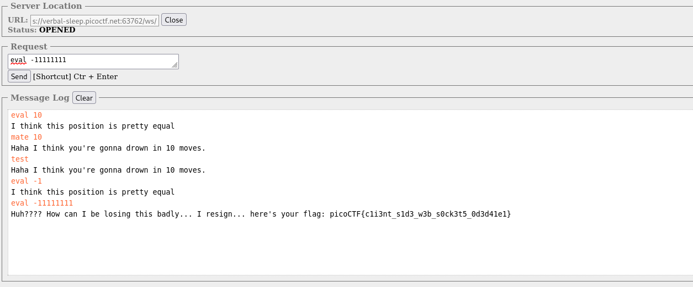

# WebSockFish

After I played a bit with the chess UI, I found the frontend is using WebSocket with this url, `ws://verbal-sleep.picoctf.net:63762/ws/`.

Also, the server expects either `eval $number` or `mate $number`.
```javascript
if (event.data.includes("mate")) {
  message = "mate " + parseInt(splitString[9]);
} else {
  message = "eval " + parseInt(splitString[9]);
}
```

I connected to the websocket and got the flag when I put `eval` with big negative number.

