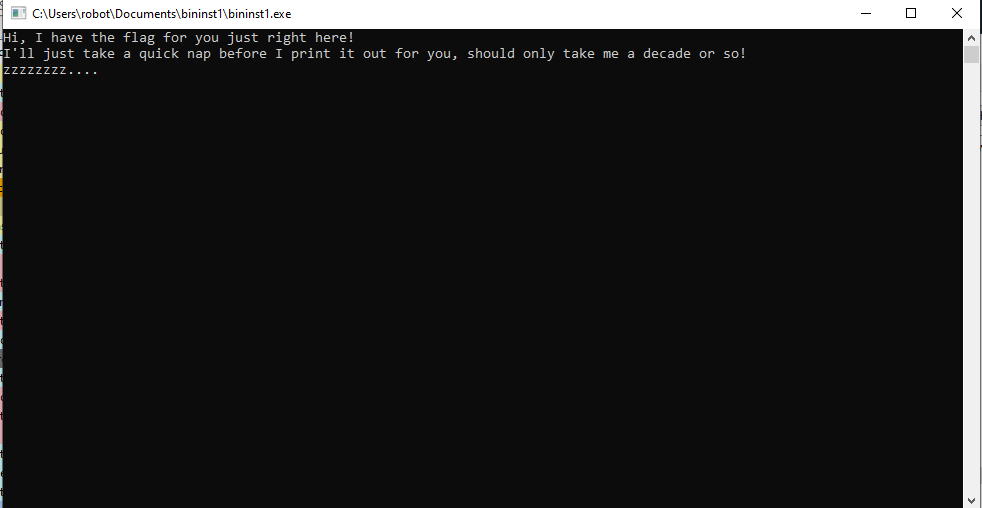

# Binary Instrumentation 1

When I executed the program, the program sleeps after it outputs some strings.

At the same time, I launched process hacker and opened the process.

When I saw strings in the process, I found the flag.

