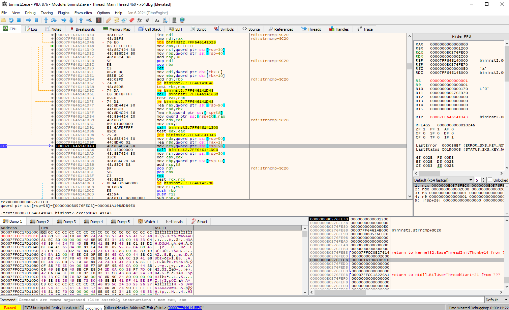
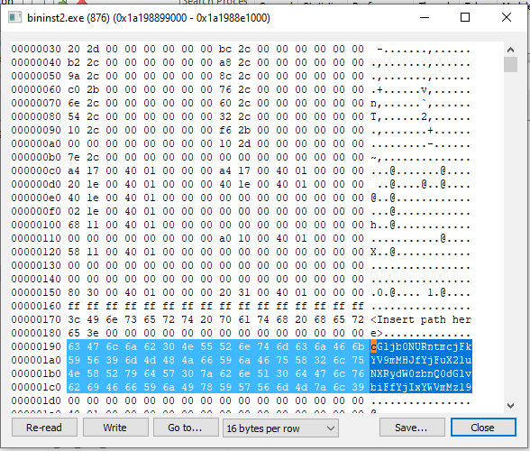

# Binary Instrumentation 2

When I executed the program, it doesn't sleep, exit immediately.

Therefore, I used `x64dbg` to debug the program.

After I steped over before the program exited, I found the flag in the process.

