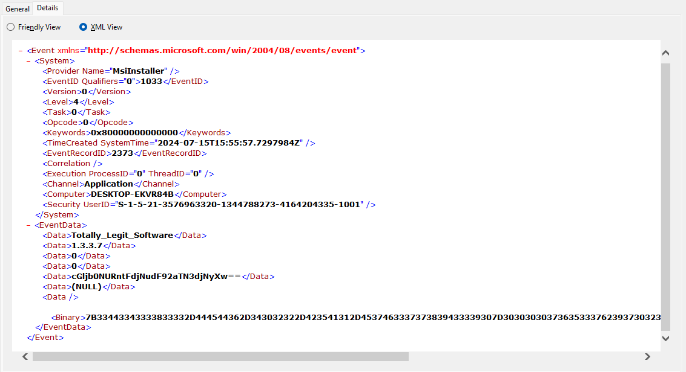
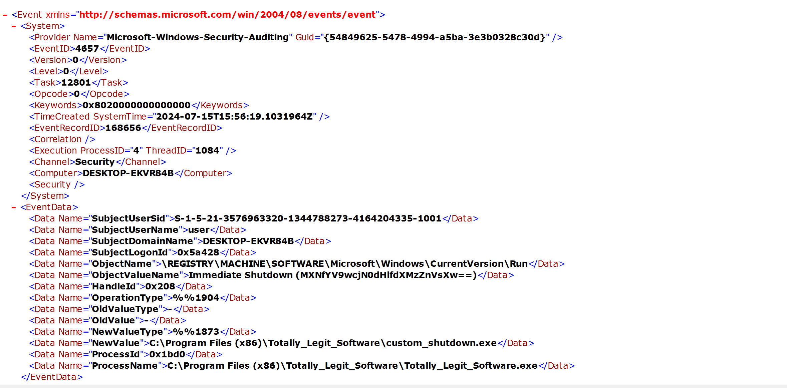
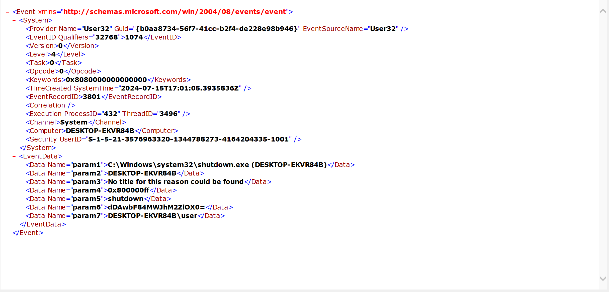

# Event-Viewing

- first evidence
> 1. They installed software using an installer they downloaded online

According to the description, I searched installation event. With the event id `1033`, I found the first evidence in the `Data` column.

- second and third evidence
> 2. They ran the installed software but it seemed to do nothing
> 3. Now every time they bootup and login to their computer, a black command prompt screen quickly opens and closes and their computer shuts down instantly.

According to the description, I guess the software might modify the registry and register a startup script.
With the event id `4657`, I found the second in the `Data Name` column.

Since the computer shuted down, I searched a shutdown event. With the event id `1074`, I found the third in the `Data` column.

By decoding those base64 strings, then combining them, I got the flag.
