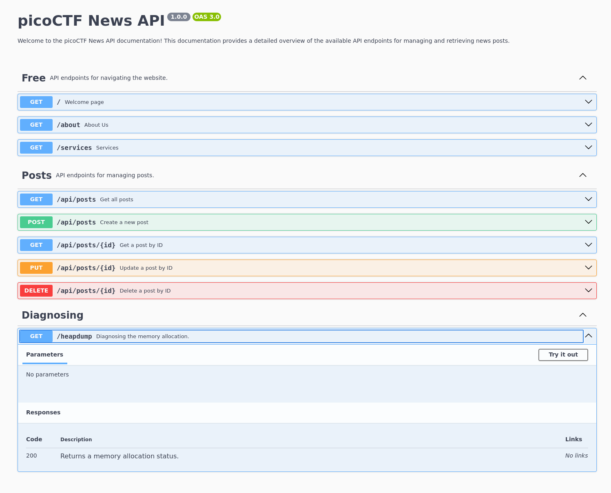

# heap-dump

There is /api-doc endpoint rewritten in html.
This endpoint displays a swagger UI.



I found the /heapdump endpoint to download heapdump file.
After downloading the dump file, I found the flag from the dump file.
```
grep -r "pico" heapdump-1741426634090.heapsnapshot
```
