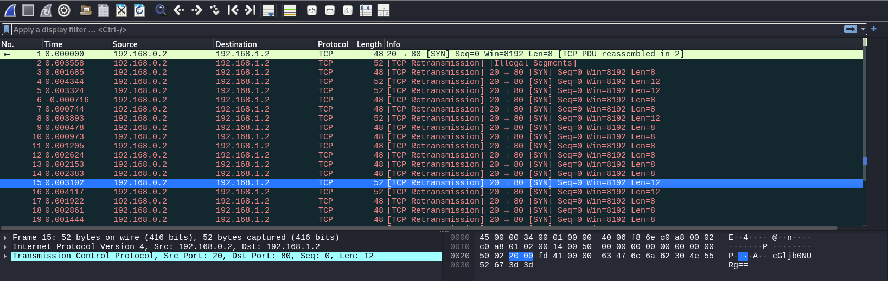

# Ph4nt0m 1ntrud3r

Packets with 4 or 12 bytes have a base64 encoded string.



I sorted these base64 string by the timestamp.
After decoding and connecting them, I got the flag.
```
cGljb0NURg==
ezF0X3c0cw==
YmhfNHJfOQ==
XzM0c3lfdA==
NjZkMGJmYg==
fQ==

b'picoCTF'
b'{1t_w4s'
b'bh_4r_9'
b'_34sy_t'
b'66d0bfb'
b'}'
```
